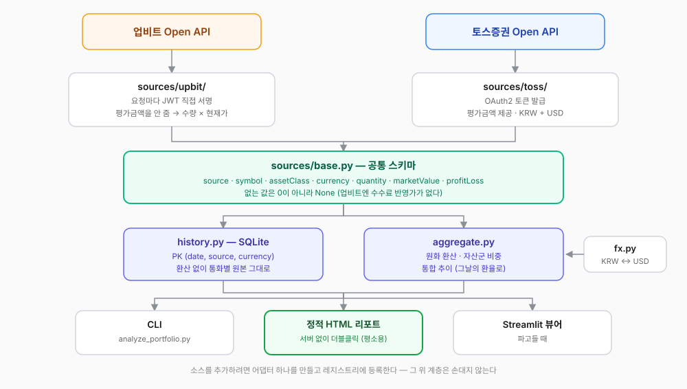
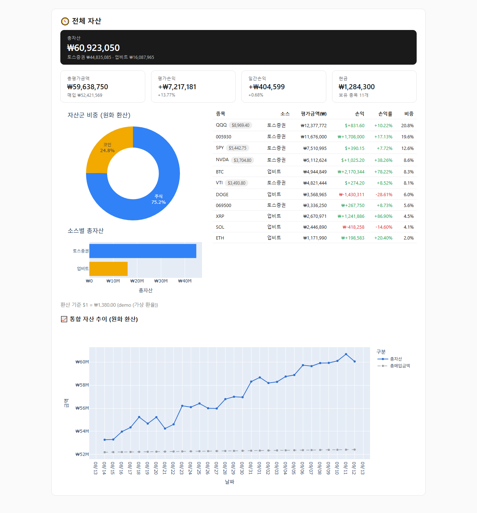
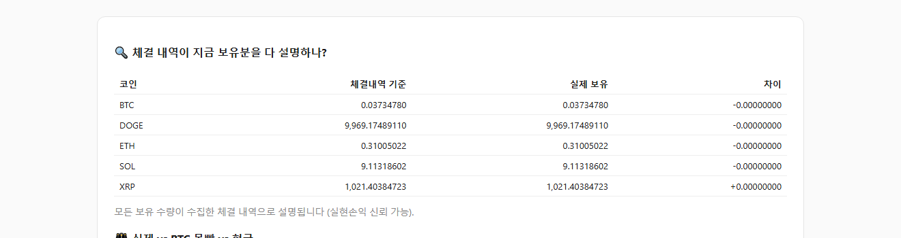
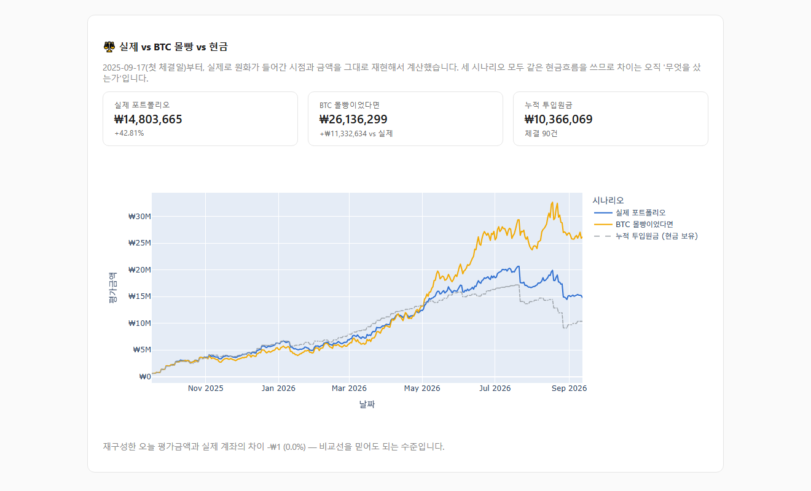

import Callout from '../../../components/post/Callout.astro';

## Introduction

Over several weeks I built two portfolio analyzers. One watched stocks through the Toss Securities Open API, the other crypto through the Upbit Open API. Each worked fine. Every morning a scheduler took a snapshot, refreshed an HTML report, and a double-click brought up the charts.

Then one day I realized I couldn't answer a very simple question.

> **"So what is my total net worth, and what percentage of it is crypto?"**

I had to open two reports and do arithmetic in my head. Worse, one was in won and the other in dollars, so mental arithmetic didn't even work. I had built two tools and still couldn't see the thing I wondered about most often.

So I merged them. This post records the parts of that job that were **decisions rather than file moves**.

## Before merging: the two projects were already twins

The starting position was lucky. When I built the crypto side I followed the structure of the stock side, so the filenames and the division of responsibilities were nearly identical.

| | coin-portfolio-analyzer | toss-portfolio-analyzer |
|---|---|---|
| Lines of code | ~2,850 | ~1,310 |
| Modules | client / portfolio / history / recorder / report / snapshot / app / benchmark **+ trades** | same, without trades |

`history.py`, `recorder.py`, `snapshot.py`, `report.py`, and `app.py` had effectively the same skeleton. Which means the substance of merging wasn't "delete the overlapping code" — it was deciding **where to absorb the things the two exchanges give you differently.**

And the two APIs give the same things very differently.

| | Upbit | Toss Securities |
|---|---|---|
| Auth | Sign a JWT per request | OAuth2 token issuance |
| Market value | **Not provided** (compute quantity × price) | Provided, pre-computed |
| Currency | KRW only | KRW and USD |
| Cash balance | Mixed into the holdings list | Absent from the response entirely |
| Cost-adjusted price | None | Provided via an `afterCost` field |

## Fork one: rebuild, or relocate?

I actually had a design document written for this integration ahead of time. Split the layers (collection / domain / aggregation / verification), force every monetary value through `Decimal`, validate external responses with Pydantic, pass seven verification gates — a fairly convincing document.

Going that route was two to three weeks of work. It also meant rewriting all 4,000 currently-working lines.

So I chose **pragmatic integration**: move the working code as-is and add only a single new adapter layer. Verification gates and enforced `Decimal` were deferred to the next stage.

I consider that a judgment rather than a compromise. The point of this tool is that I open it every day. Between enduring three weeks of seeing nothing in exchange for a perfect design, and seeing a unified screen within days and hardening it afterward, the second has a **higher probability of actually being finished.** Completion over completeness.

## Where to put the boundary

It comes down to one file. `sources/base.py` — whatever differs per exchange is absorbed here, and the layers above (recording, aggregation, display) only ever see the same schema no matter how many sources exist.



```python
POSITION_COLUMNS = [
    "source",          # upbit | toss
    "symbol",          # BTC, AAPL
    "name",
    "assetClass",      # crypto | equity
    "currency",        # KRW | USD
    "quantity", "avgPrice", "lastPrice",
    "purchaseAmount", "marketValue",
    "profitLoss", "profitLossRate", "dailyProfitLoss",
]
```

To add another source you write a class with `fetch() -> SourceData` and register it. Nothing above changes.

## The four real problems merging surfaced

### 1. How do you add currencies — when nobody gives you an exchange rate?

To add won assets and dollar assets and call the result "net worth," you need an exchange rate. And **neither Upbit nor Toss Securities provides one.** Reasonable enough: they're asset lookup APIs, not FX APIs.

I settled on Upbit's `KRW-USDT` price as the default. It's a public API needing no auth, so it still works for someone using only Toss, and it adds no new dependency.

The problem is **that isn't a real exchange rate.** USDT prices on Korean exchanges carry a won premium, typically running 0–3% above the actual base rate. On a portfolio of tens of millions of won, that's hundreds of thousands of won swinging around.

Rather than hide it, I surfaced it.

- The screen **always shows the rate used and where it came from.** Show only the number and hide the rate, and later you cannot answer "where did this value come from?"
- Put an official rate in `FX_USDKRW` in `.env` and it takes precedence.

And one more thing. **Converted amounts are never stored in the database.**

```
The snapshots table stores USD assets as USD.
Conversion happens only at render time. The rate used that day is kept separately in fx_rates.
```

Store the converted value and that day's rate is frozen into the snapshot. The moment you later change the rate basis, the entire historical record becomes untrustworthy. The unified trend chart must not convert the past at today's rate either — assets in the past would look wholesale different by however much the rate moved.

<Callout>
	**Don't store derived values; store the inputs that produced them.** Keep the original currency and
	that day's rate rather than the converted amount, and the historical record survives a change in
	rate basis. Each day's assets at that day's rate.
</Callout>

### 2. Filling a missing value with zero fails silently

Toss provides a cost-adjusted market value (`afterCost`); Upbit doesn't. Building the common schema, the question was what to put in that column.

Fill it with 0 and the schema is clean. And you get **"total market value after fees: ₩0"** — a quietly wrong number. No exception, and the screen looks fine.

So I left it `NULL`. The DB column is nullable and the screen only shows the value for sources that have it. I could have faked it for Upbit by multiplying in the sell fee (0.05% on the KRW market), but I couldn't be sure from the response alone whether the average buy price already included the buy fee. **Marking what you don't know as unknown beats inventing something plausible.**

The same principle applies to net worth. If no rate is available, I don't add up only the won assets and call it "net worth" — that's a figure with the dollar assets vanished. In that case it shows per-currency amounts instead of a total, and states why.

<Callout>
	`0` doesn't read as "unknown," it reads as "none." Fill an unknown cell with zero and there's no
	exception and no visual glitch — only a wrong number. **Better to omit the total and say why than to
	show a wrong one.**
</Callout>

### 3. The primary keys collided

The `snapshots` tables in the two projects looked like this:

- Crypto: PK `(date, unit_currency)`
- Stocks: PK `(date, currency)`

Both write a KRW row. Merged as-is, **the crypto snapshot and the stock KRW snapshot overwrite each other on the same day.** So I changed it to `(date, source, currency)`.

That one-line change had surprisingly wide fallout. Everywhere calling `load_history(currency)` had to become `load_history(source=..., currency=...)`. In particular the S&P 500 comparison code reads the earliest date from `history` to use as a start date — without passing `source`, **crypto snapshot dates leak in as the start date for the stock benchmark.** No error, just a wrong graph: exactly the kind of bug found last.

### 4. What if one exchange goes down?

A new failure mode created by merging. Upbit only accepts calls from the IP registered at key issuance, so when my home IP changes I get a `no_authorization_i_p` error. Losing visibility into my stocks at the same time would be bad.

If one source fails the rest carry on. But the net worth in that moment is an incomplete total, so the screen gets a **"⚠ partially excluded"** marker. Quietly showing a smaller number is the worst option.

## Accumulated records can't be thrown away

There was one annoying constraint. **Exchanges have no "my past market value" API.** Both give only the current snapshot. So both projects had been recording today's value into their own SQLite daily — and that is **data you cannot backfill.** Discard it while building the new project and it's gone forever.

So I wrote the migration script first.

```bash
python scripts/migrate_legacy.py --dry-run   # count only
python scripts/migrate_legacy.py             # actually migrate
```

Two rules. **The source DBs are opened read-only (`mode=ro`)** so that even a mistake can't touch the originals. And everything is `INSERT OR REPLACE`, so it's safe to run repeatedly. Daily snapshots, per-position snapshots, fills, daily closes, and benchmark baselines came across — roughly 5,700 rows.

Checking afterward, Upbit KRW rows and Toss USD rows coexisted side by side, and the cost-adjusted price was correctly `NULL` for Upbit only. I **deliberately left the two original projects in place.** There's no reason to delete them before the new path runs cleanly for a few days.

## So what came out of it



The question I couldn't answer now has an answer on one screen. Net worth, crypto versus stocks, per-source weights, and the unified daily trend.

Below that, the contents of the two old reports appear as per-source sections: Upbit with per-coin holdings, realized P&L, and an all-in-BTC comparison; Toss with per-currency holdings and an all-in-S&P 500 comparison.

There are three ways to look at it and all three produce the same numbers, because they share the same calculation logic. Day to day it's the **static HTML report** you double-click with no server; there's a **CLI** for a quick look in the terminal, and a **Streamlit viewer** for digging with filters.

## A tangent: the demo mode I built to take screenshots

I wanted report screenshots in this post, but the real report contains my actual positions and amounts. Masking them in an image editor is manual every time, and missing one spot publishes it.

So I built a **demo mode**.

```bash
python scripts/demo_report.py
```

It renders the report from fake data. The safeguards are structural — a different DB file (`demo_history.db`), a different output file, and API clients that are stubs never touching the network, so it runs without keys. The real account DB is never even opened.

But **parsing, aggregation, and rendering run through the real code.** It feeds the adapter's `build()` a response shaped exactly like the real API, so the layout matches the real report. Every screenshot here was made this way.

Something interesting happened here. At first I generated the fake holdings and the fake fills **separately**, and the report warned me:

> ⚠ Today's market value reconstructed from fills differs from the actual account by 81.6%.

Of course it did. I'd invented the two independently, so there was no way they'd agree. But that was also **evidence the verification logic works.** So I fixed the demo data — generate the fills first, and **use the resulting balances as the holdings.**



The quantities match to eight decimal places. And on the comparison chart drawn from the same data, the reconstruction error came out at **₩1 (0.0%)** — floating-point rounding.



Building a tool for documentation ended up verifying the accuracy of the calculation logic for free.

## Principles from the merge

- **Don't store converted amounts.** Store the original currency and convert only at display time. Keep the rate used separately.
- **Don't fill missing values with zero.** Zero reads as "none," not "unknown."
- **Rather than show a wrong total, show no total.** State why you can't produce one instead.
- **Query the API once.** If recording, reporting, and display each query separately, prices move in between and numbers disagree within the same screen.
- **Preserve non-backfillable data at all costs.** Code can be rewritten; past dates cannot be recovered.

## Closing

My favorite outcome of the merge is the scheduler. I used to need a separate task per exchange (9:00 crypto, 9:05 stocks); now one task records both.

I still haven't added the verification gates from the design document — the layer that reconciles balance totals against exchange-displayed values, checks that quantity × price matches market value, and hides the numbers entirely if it doesn't pass. That's next.

But I confirmed one thing here. **Draw the boundary properly and merging is cheaper than you'd think.** The two projects weren't coincidentally the same shape: a decision made while building one — to follow the other's structure — paid off weeks later. At the time I did it only because the structure was familiar.

*This post is adapted from my loopery-portfolio integration notes. It is not investment advice, and every screen shown here was produced from fake data.*
