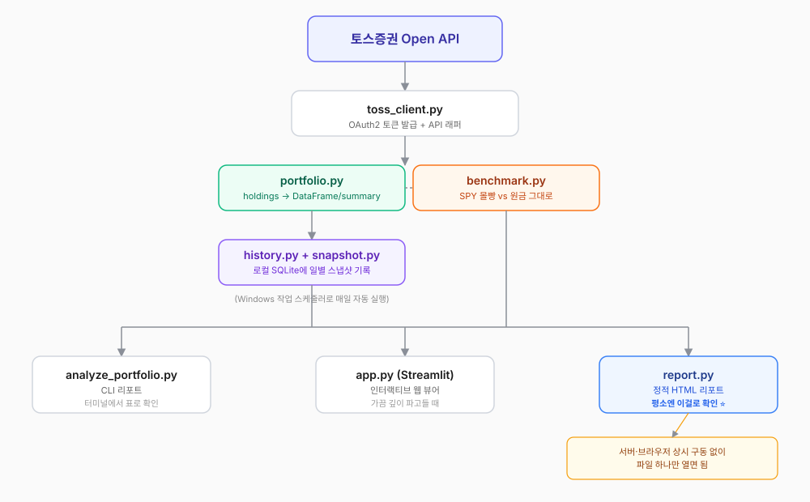

import Callout from '../../../components/post/Callout.astro';

## Introduction

When I decided to get serious about algorithmic trading, the first milestone was deliberately modest: **build one program that pulls the products I'm actually invested in through an API and analyzes them.** I applied for Toss Securities Open API access, got a `client_id` and `client_secret`, then opened Claude Code in a terminal and wired it up piece by piece. This post is that process as it happened — especially the parts where I tripped.

## Reading the API first

The official documentation has gaps, so instead of writing code immediately I spent time confirming the API surface. In short:

- Base URL is `https://openapi.tossinvest.com`; auth is OAuth2 Client Credentials Grant (`POST /oauth2/token`)
- `GET /api/v1/accounts` lists accounts, `GET /api/v1/holdings` returns positions (the latter needs an `X-Tossinvest-Account` header)
- `GET /api/v1/prices` gives live quotes, `GET /api/v1/candles` gives daily and intraday candles

The first principle I learned here: **do not guess response field names and write the parser first.** Instead I built a script called `inspect_api.py` that dumps raw JSON, confirmed the actual field structure with my own eyes, and only then wrote the parsing logic. That paid off with an unexpected finding — the `holdings` response already includes current price, market value, and P&L, so there was no need to query quotes separately at all.

## The architecture changed three times

It started as a single CLI script: `toss_client.py` (API wrapper) → `portfolio.py` (shared logic turning the holdings response into a pandas DataFrame) → `analyze_portfolio.py` (a report printed as a terminal table).

Then, to satisfy "I'd rather look at a viewer than a table," I added a Streamlit web dashboard (`app.py`) — pie chart, per-position table, daily asset trend line chart. Which surfaced a new problem: **the Toss API has no history endpoint for past market values.** So I adopted an approach where every time the app opens (or daily via a scheduler) it writes today's snapshot into a local SQLite database (`history.py`, `snapshot.py`). It accumulates from today forward, which makes the limitation explicit: you cannot backfill the past.

I layered one more fun feature on top: a chart (`benchmark.py`) comparing the real portfolio side by side against **"what if I had put the entire principal into the S&P 500 (SPY) today?"** versus **"what if I had just held cash?"** The API doesn't provide the index itself, so I used the SPY ETF as a proxy.

But once it was all built, the feedback was: "having to run `streamlit run` and keep a browser tab open every time I want to check this is still a bit awkward." Fair. So I changed direction one last time — to a **static HTML report** (`report.py`) with Plotly.js inlined into the file itself. Now a scheduler refreshes a single file daily and all I do is double-click it, or refresh a pinned browser tab. No server, no terminal left running. The Streamlit app stays for the occasional deeper dig.

## The five bugs I actually hit

Summarized first. How fast I found each one turned out to be inversely related to how serious it was.

| # | Symptom | Cause | Time to find |
|---|---|---|---:|
| 1 | Real keys landed in the template file | Confused the roles of `.env` and `.env.example` | Immediate |
| 2 | `account-not-found` 400 | Header needs `accountSeq`, not `accountNo` | Medium |
| 3 | Total market value showed 0.00 | Uppercase `"USD"` vs lowercase `"usd"` key | **Slow** |
| 4 | SQL binding count mismatch | 9 columns, 8 values | Immediate |
| 5 | Two scenarios started on different dates | Date filter also excluded fallback candidates | **Slowest** |

### 1. Pasting real keys into `.env.example`

I suggested running `inspect_api.py` for the first time, and it came back with the real `client_id` and `client_secret` written into `.env.example` rather than `.env`. Because `.env.example` is meant to be an empty template, it is not covered by `.gitignore` — committing in that state would have published live keys. Fortunately this was before the git repository existed, so nothing actually leaked, but we re-clarified the roles of `.env` (real values) and `.env.example` (empty template) before moving on.

### 2. Filling the header with accountNo and getting `account-not-found`

I put `accountNo` (the 11-digit account number) from the `accounts` response straight into the `X-Tossinvest-Account` header and got a 400. I changed the code to print the error body verbatim and the cause was "the account number could not be found." The official docs alone weren't enough to be sure of the exact header format; only after looking at real usage in a third-party open-source project (tossinvest-mcp) did I confirm the header wants **`accountSeq`** (usually `"1"`), not `accountNo`.

### 3. Uppercase `"USD"` vs lowercase `"usd"`

In the `holdings` response, the per-position `currency` field is `"USD"` (uppercase), while the keys of top-level dictionaries like `totalPurchaseAmount` and `marketValue` are `"usd"` (lowercase). Looking it up as-is fell silently to `None` → 0 with no exception, so the screen simply read "total market value 0.00."

<Callout>
	A bug that throws gets caught immediately. A bug that quietly falls back to a default survives.
	When pulling keys out of an external API response, the default should be **fail loudly**, not
	"zero if missing."
</Callout>

### 4. SQL binding count mismatch

I declared nine columns in a SQLite INSERT and passed a tuple with only eight values — a simple slip that dropped `captured_at`. This threw immediately, so it was actually one of the fastest to catch.

### 5. A date filter that also excluded the fallback candidates (the tricky one)

This took the longest, prompted by the feedback that "the S&P 500 all-in and cash scenarios seem to start on a different date than the real portfolio trend." I was filtering historical SPY closes to a `since ~ until` range. The start date happened to fall on a weekend, so there was no candle that day — and the fallback data I intended to substitute ("use the prior trading day's close") was caught by the same filter and excluded wholesale, which meant the sync function **did nothing and returned silently.** Meanwhile stale rows from an older schema were still sitting there, which made it look as though the two scenarios began on different days.

Two fixes. I removed the lower-bound filter and generalized to forward-fill logic that applies **to every date**, not just the start date: if there's no close for that day, carry the most recent trading day's close forward. Then I removed the duplication where the real portfolio value was being stored separately in the benchmark table, and rewrote it to join against `history` (the real trend) on date.

<Callout>
	Store the same value in two places and they will eventually disagree. Fixing only the symptom
	invites the next divergence; changing the structure so that **divergence is impossible** removes
	that whole class of bug. Replacing duplicate storage with a join was the real substance of this fix.
</Callout>

## The principles so far

- Don't guess response field names and write the parser first. Look at the raw JSON.
- Make the CLI, web viewer, and static report share the calculation logic (`portfolio.py`, `benchmark.py`). Fix one bug and all three are fixed.
- Code does not make trading calls ("buy" / "sell"). It computes fact-based metrics only: weights, P&L rates, top positions.
- Don't touch order/trade APIs at this stage. That comes after read-only is thoroughly validated.

## Closing

I didn't build some grand automated trading system. Right now it is just a tool that reads my account through an API and shows it as tables and charts. But the auth flow, the traps in response schemas, and the instinct for finding bugs that **fail silently** — those are the baseline fitness I needed before moving on to backtesting and signal development. The next post will get into backtesting strategies against historical prices.

*This post is adapted from the toss-portfolio-analyzer build log I keep in my personal wiki.*
