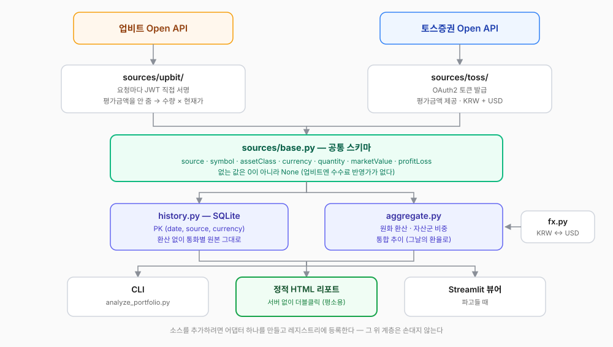
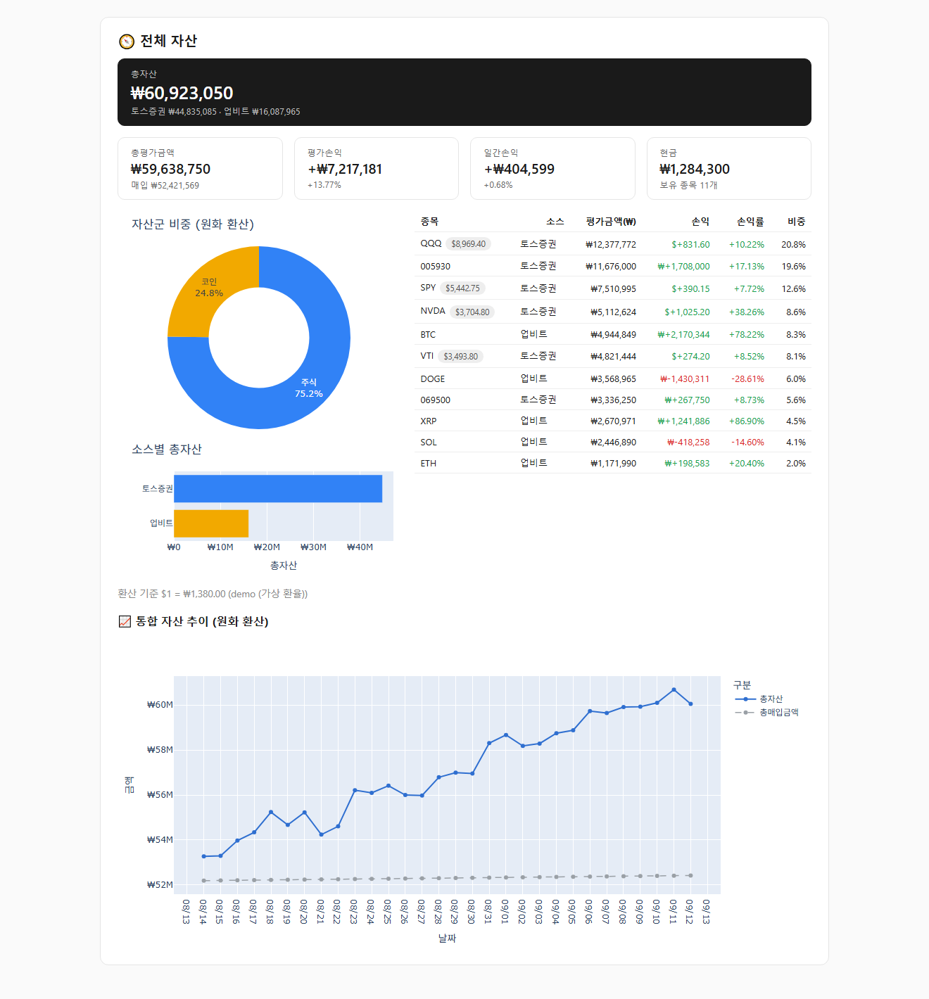
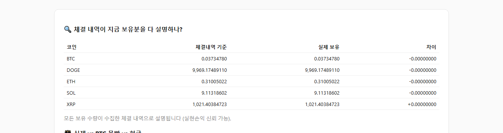
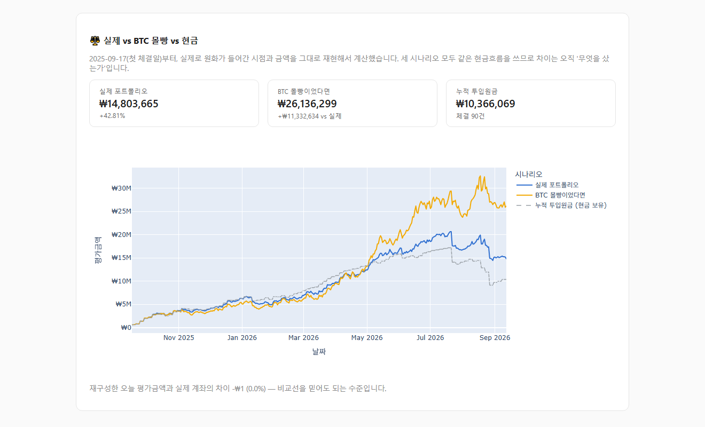

## 들어가며

몇 주에 걸쳐 포트폴리오 분석기를 두 개 만들었다. 하나는 토스증권 Open API로 주식을 보는 것, 다른 하나는 업비트 Open API로 코인을 보는 것. 각각은 잘 돌아갔다. 매일 아침 스케줄러가 스냅샷을 찍고, HTML 리포트를 갱신하고, 더블클릭하면 차트가 뜬다.

그런데 어느 날 아주 단순한 질문에 답할 수 없다는 걸 깨달았다.

> **"그래서 내 총자산이 얼마고, 그중 코인 비중이 몇 퍼센트지?"**

리포트를 두 개 열어놓고 암산을 해야 했다. 심지어 한쪽은 원화, 한쪽은 달러라 암산도 안 됐다. 도구를 두 개 만들었는데 정작 가장 자주 궁금한 걸 못 보고 있었던 것이다.

그래서 합쳤다. 이 글은 그 과정에서 **"파일을 옮기는 일"이 아니라 "결정을 내리는 일"이었던 부분들**에 대한 기록이다.

## 합치기 전: 두 프로젝트는 이미 쌍둥이였다

다행히 시작이 좋았다. 코인 쪽을 만들 때 주식 쪽 구조를 그대로 따라갔기 때문에, 파일 이름부터 역할 분담까지 거의 같았다.

| | coin-portfolio-analyzer | toss-portfolio-analyzer |
|---|---|---|
| 코드량 | 약 2,850줄 | 약 1,310줄 |
| 모듈 | client / portfolio / history / recorder / report / snapshot / app / benchmark **+ trades** | 같은 구성 (trades 없음) |

`history.py`, `recorder.py`, `snapshot.py`, `report.py`, `app.py`는 골격이 사실상 동일했다. 그러니 합치는 일의 본질은 "겹치는 코드를 지우는 것"이 아니라, **두 거래소가 서로 다르게 주는 것들을 어디서 흡수할 것인가**를 정하는 일이었다.

두 API는 같은 것을 전혀 다르게 준다.

| | 업비트 | 토스증권 |
|---|---|---|
| 인증 | 요청마다 JWT를 직접 서명 | OAuth2 토큰 발급 |
| 평가금액 | **안 준다** (수량 × 현재가로 직접 계산) | 계산해서 준다 |
| 통화 | KRW 하나 | KRW와 USD 둘 |
| 현금 잔고 | 보유 목록에 섞여서 온다 | 응답에 아예 없다 |
| 수수료 반영가 | 없음 | `afterCost` 필드로 제공 |

## 갈림길 하나: 다시 지을 것인가, 옮길 것인가

사실 이 통합에 대한 설계 계획서를 미리 써둔 게 있었다. 계층을 나누고(collection / domain / aggregation / verification), 금액은 전부 `Decimal`로 강제하고, 외부 응답을 Pydantic으로 검증하고, 검증 게이트 7개를 통과시키는 — 꽤 그럴듯한 문서였다.

그런데 그대로 가면 2~3주짜리 작업이었다. 지금 잘 돌아가는 4,000줄을 전부 다시 쓰는 셈이기도 했다.

그래서 **실용적 통합**을 골랐다. 돌아가는 코드를 그대로 옮기고, 어댑터 한 겹만 새로 씌우는 방식. 검증 게이트와 `Decimal` 강제는 다음 단계로 미뤘다.

이건 타협이 아니라 판단이라고 생각한다. 이 도구의 목적은 "매일 열어보는 것"인데, 3주 동안 아무것도 못 보는 상태를 견디면서 완벽한 설계를 얻는 것보다, 며칠 안에 통합 화면을 보고 그다음에 단단하게 만드는 쪽이 **끝까지 갈 확률이 높다.** 완성도보다 완주다.

## 경계를 어디에 둘 것인가

핵심은 파일 하나다. `sources/base.py` — 거래소마다 다른 걸 여기서 흡수하고, 그 위 계층(기록·합산·표시)은 소스가 몇 개든 같은 스키마만 보게 한다.



```python
POSITION_COLUMNS = [
    "source",          # upbit | toss
    "symbol",          # BTC, AAPL
    "name",
    "assetClass",      # crypto | equity
    "currency",        # KRW | USD
    "quantity", "avgPrice", "lastPrice",
    "purchaseAmount", "marketValue",
    "profitLoss", "profitLossRate", "dailyProfitLoss",
]
```

소스를 하나 더 붙이려면 `fetch() -> SourceData`를 가진 클래스를 만들고 레지스트리에 등록하면 된다. 그 위는 손대지 않는다.

## 합치면서 마주친 진짜 문제 4가지

### 1. 통화를 어떻게 더할 것인가 — 그런데 환율을 아무도 안 준다

원화 자산과 달러 자산을 더해서 "총자산"을 말하려면 환율이 필요하다. 그런데 **업비트도 토스증권도 환율을 주지 않는다.** 자산 조회 API지 환전 API가 아니니 당연하다.

기본값으로 업비트의 `KRW-USDT` 현재가를 쓰기로 했다. 인증이 필요 없는 공개 API라 토스만 쓰는 사람도 그대로 돌아가고, 새 의존성이 없다.

문제는 **이게 진짜 환율이 아니라는 것이다.** 국내 거래소 USDT 가격에는 원화 프리미엄이 섞여 있어서 실제 매매기준율보다 보통 0~3% 높게 나온다. 총자산이 몇천만 원이면 수십만 원이 왔다 갔다 한다.

숨기는 대신 드러내기로 했다.

- 화면에 **쓴 환율과 그 출처를 항상 같이 보여준다.** 숫자만 보여주고 환율을 숨기면 나중에 "이게 어디서 온 값이지?"에 답할 수 없다.
- `.env`의 `FX_USDKRW`에 고시환율을 직접 넣으면 그걸 우선 쓴다.

그리고 하나 더. **환산한 금액은 절대 DB에 저장하지 않는다.**

```
snapshots 테이블에는 USD 자산이 USD 그대로 들어간다.
환산은 화면에 그릴 때만. 그날 쓴 환율은 fx_rates에 따로 남긴다.
```

환산해서 저장하면 그날의 환율이 스냅샷에 굳어버린다. 나중에 환율 기준을 바꾸는 순간 과거 기록 전체가 못 믿을 값이 된다. 통합 추이 차트도 오늘 환율로 과거까지 환산하면 안 된다 — 환율이 움직인 만큼 과거 자산이 통째로 달라 보인다. **그날의 자산은 그날의 환율로.**

### 2. 없는 값을 0으로 채우면 조용히 틀린다

토스는 수수료를 반영한 평가금액(`afterCost`)을 주는데 업비트는 안 준다. 공통 스키마를 만들면서 이 칸을 뭘로 채울지가 문제였다.

0으로 채우면 스키마는 깔끔해진다. 그리고 **"수수료 반영 후 총평가금액 0원"**이라는 조용히 틀린 숫자가 나온다. 예외도 안 나고, 화면은 멀쩡해 보인다.

그래서 `NULL`로 뒀다. DB 컬럼도 nullable로 만들고, 화면에서는 그 값이 있는 소스만 보여준다. 업비트에도 매도 수수료(원화마켓 0.05%)를 곱해서 흉내 낼 수도 있었지만, 평균매수가에 매수 수수료가 포함되는지를 응답만 봐서는 확신할 수 없었다. **모르는 건 모른다고 표시하는 게 그럴듯하게 지어내는 것보다 낫다.**

같은 원칙이 총자산에도 적용된다. 환율을 못 구하면 원화 자산만 더해서 "총자산"이라고 하지 않는다. 그건 달러 자산이 통째로 증발한 값이다. 그럴 땐 합계 대신 통화별 금액을 보여주고 이유를 적는다.

### 3. 기본키가 충돌했다

두 프로젝트의 `snapshots` 테이블은 각각 이렇게 생겼었다.

- 코인: PK `(date, unit_currency)`
- 주식: PK `(date, currency)`

둘 다 KRW 행을 쓴다. 그대로 합치면 **같은 날 코인 스냅샷과 주식 KRW 스냅샷이 서로를 덮어쓴다.** 그래서 `(date, source, currency)`로 바꿨다.

이 한 줄짜리 변경이 은근히 파급이 컸다. `load_history(currency)`를 부르던 곳이 전부 `load_history(source=..., currency=...)`가 돼야 했다. 특히 S&P500 비교 코드는 `history`에서 가장 이른 날짜를 읽어 시작일로 삼는데, `source`를 안 넘기면 **코인 스냅샷 날짜가 주식 벤치마크의 시작일로 섞여 들어간다.** 에러는 안 나고 그래프만 이상해지는, 제일 늦게 발견될 종류의 버그다.

### 4. 한쪽 거래소가 죽으면?

합치면서 새로 생긴 실패 모드다. 업비트는 발급 시 등록한 IP에서만 호출되는데, 집 IP가 바뀌면 `no_authorization_i_p` 에러가 난다. 그때 주식 자산까지 못 보게 되면 곤란하다.

한 소스가 실패해도 나머지는 계속 간다. 다만 그때의 총자산은 불완전한 합계이므로 화면에 **"⚠ 일부 제외"**를 붙인다. 조용히 작은 숫자를 보여주는 게 제일 나쁘다.

## 쌓아둔 기록은 버릴 수 없다

한 가지 성가신 제약이 있었다. **거래소에 "과거 내 평가금액" API가 없다.** 양쪽 다 현재 스냅샷만 준다. 그래서 두 프로젝트 모두 매일 자기 SQLite에 오늘자 값을 기록해왔는데, 이건 **과거로 소급이 안 되는 데이터**다. 새 프로젝트를 만들면서 버리면 영영 복구할 수 없다.

그래서 이관 스크립트를 먼저 썼다.

```bash
python scripts/migrate_legacy.py --dry-run   # 건수만 확인
python scripts/migrate_legacy.py             # 실제 이관
```

두 가지를 지켰다. **원본 DB는 읽기 전용(`mode=ro`)으로 연다** — 실수로도 원본을 건드리지 않기 위해. 그리고 전부 `INSERT OR REPLACE`라 여러 번 돌려도 안전하다. 일별 스냅샷, 종목별 스냅샷, 체결 내역, 일봉 종가, 벤치마크 기준선까지 5,700행 남짓이 넘어왔다.

이관 후 확인해보니 업비트 KRW 행과 토스 USD 행이 나란히 공존하고, 수수료 반영가는 업비트만 `NULL`로 잘 들어가 있었다. 기존 두 프로젝트는 **일부러 그대로 남겨뒀다.** 새 경로가 며칠 멀쩡히 도는 걸 확인하기 전에 지울 이유가 없다.

## 그래서 결과는



처음에 답할 수 없던 질문에 이제 한 화면에서 답이 나온다. 총자산, 코인 대 주식 비중, 소스별 비중, 그리고 통합 일별 추이까지.

그 아래로는 예전 두 리포트의 내용이 소스별 섹션으로 그대로 들어간다. 업비트 쪽은 코인별 보유 현황·실현손익·BTC 몰빵 비교, 토스 쪽은 통화별 보유 현황·S&P500 몰빵 비교.

보는 방법은 세 가지인데 숫자는 셋 다 같다. 같은 계산 로직을 공유하기 때문이다. 평소엔 서버 없이 더블클릭하는 **정적 HTML 리포트**, 터미널에서 빠르게 보는 **CLI**, 필터를 걸어가며 파고드는 **Streamlit 뷰어**.

## 곁가지: 스크린샷을 찍으려다 만든 데모 모드

이 글에 리포트 화면을 싣고 싶었는데, 진짜 리포트에는 보유 종목과 금액이 그대로 들어있다. 이미지 편집기로 가리자니 매번 손이 가고, 한 군데라도 빠뜨리면 그대로 공개된다.

그래서 **데모 모드**를 만들었다.

```bash
python scripts/demo_report.py
```

가짜 데이터로 리포트를 렌더링한다. 안전장치는 구조로 걸었다 — 다른 DB 파일(`demo_history.db`)과 다른 출력 파일을 쓰고, API 클라이언트는 네트워크를 타지 않는 스텁이라 키가 없어도 돌아간다. 실제 계좌 DB는 열리지도 않는다.

대신 **파싱·집계·렌더링은 진짜 코드 그대로 탄다.** 어댑터의 `build()`에 실제 API와 같은 모양의 응답을 넣어주는 방식이라, 화면 구성은 진짜 리포트와 동일하다. 위와 아래의 스크린샷은 전부 이렇게 만든 것이다.

여기서 재미있는 일이 하나 있었다. 처음엔 가짜 보유 수량과 가짜 체결 내역을 **따로** 만들었는데, 리포트가 이렇게 경고했다.

> ⚠ 체결 내역으로 재구성한 오늘 평가금액이 실제 계좌와 81.6% 차이납니다.

당연했다. 둘을 독립적으로 지어냈으니 맞을 리가 없다. 그런데 이건 **검증 로직이 제대로 동작한다는 증거**이기도 했다. 그래서 데모 데이터를 고쳤다 — 체결 내역을 먼저 만들고, **거기서 나온 잔량을 보유 수량으로 쓰도록.**



수량이 소수점 8자리까지 맞는다. 그리고 같은 데이터로 그린 비교 차트에서 재구성 오차는 **₩1 (0.0%)** 로 나왔다 — 부동소수점 반올림 수준이다.



문서용 도구를 만들다가 계산 로직의 정확성까지 덤으로 확인한 셈이다.

## 통합하면서 세운 원칙

- **환산한 금액을 저장하지 않는다.** 원본 통화 그대로 저장하고, 환산은 표시할 때만. 쓴 환율은 따로 남긴다.
- **없는 값을 0으로 채우지 않는다.** 0은 "모른다"가 아니라 "없다"로 읽힌다.
- **틀린 합계를 보여주느니 합계를 안 보여준다.** 대신 왜 못 내는지를 적는다.
- **API 조회는 한 번만 한다.** 기록·리포트·화면이 각자 조회하면 그 사이 시세가 움직여서 같은 화면 안에서 숫자가 서로 안 맞는다.
- **소급되지 않는 데이터는 무슨 일이 있어도 보존한다.** 코드는 다시 짜면 되지만 지나간 날짜는 못 되돌린다.

## 마치며

합치고 나서 제일 마음에 드는 건 스케줄러다. 예전엔 거래소마다 작업을 따로 걸어야 했는데(9시 코인, 9시 5분 주식), 이제 하나가 양쪽을 다 기록한다.

아직 계획서에 적어둔 검증 게이트는 못 넣었다. 잔고 합계를 거래소 표시값과 대조하고, 수량 × 현재가가 평가금액과 맞는지 검산하고, 통과 못 하면 숫자를 아예 숨기는 계층. 다음 차례다.

그래도 이번에 확인한 게 하나 있다. **경계를 제대로 그으면 합치는 건 생각보다 싸다.** 두 프로젝트가 우연히 같은 구조였던 게 아니라, 하나를 만들 때 다른 하나의 구조를 따라간 결정이 몇 주 뒤에 값을 한 것이다. 그때는 그냥 "익숙한 구조라 편해서" 그렇게 했을 뿐인데.

*이 글은 loopery-portfolio 통합 작업 기록을 블로그용으로 재구성한 것입니다. 투자 권유가 아니며, 본문의 모든 화면은 가짜 데이터로 만든 것입니다.*
